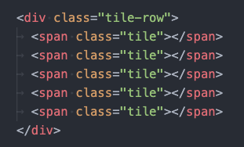
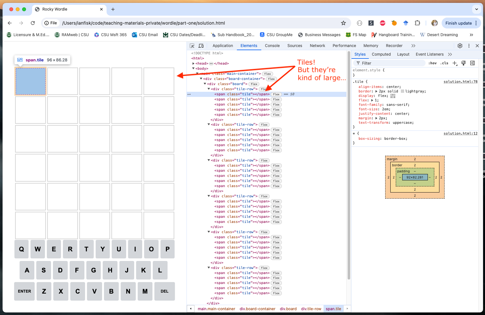
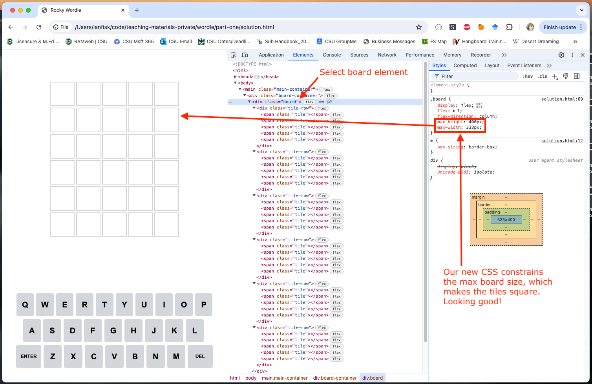

# HTML, CSS, and JS Lab One

In this lab, we're going to be creating a basic version of the [Wordle](https://www.nytimes.com/games/wordle/index.html) game in a local HTML file. In the process, we'll learn more about web development, Chrome's debugging tools, and Visual Studio Code.

## Lab Part One: Create the Wordle HTML

In Part One of this lab, we'll create all the HTML and CSS our Wordle game needs.

### 1) I've created some HTML to get you started, but we need to save it to your computer

1. On your Windows machine, create a working directory for your code:
	- Open the File Explore from the start menu (or hit the Windows key `⊞ Win` > start typing `File explorer` until you see it pop up > hit `Enter`)
	<!-- TODO: is this the right directory? -->
	- Navigate to your Documents directory
	- Create a new folder Right click > `New` > `Folder`.
	- Name the folder `html-lab-one` or something similar so you know where to find this code again
1. Open the folder you just created in VS Code:
	- Open VS Code (`⊞ Win` > start typing `Visual Studio Code` until you see it pop up > hit `Enter`)
	- In the new window, hit the open button

		

	- Navigate to the folder you created in the above step, highlight it, and click `Open`.

		

	- If a popup appears asking if you trust the authors of this folder, click "Yes I trust the authors"
1. Create a local HTML file:
	- Create a new file by right clicking in the file explorer section on the left side of the window: Right click > `New file...` > type `lab-one.html` as the file name > hit `Enter`

		
		

1. Now let's copy the code I'm giving you to start off:
	- Navigate to [this code directory](https://github.com/ianfisk/teaching-materials/tree/main/wordle/part-one) in Chrome and click on the file named `lab-template.html`.
	- Click the `Copy raw file` button near the button that says `Raw`.

		

1. Finally, go back to `lab-one.html` in VS Code and **paste the HTML into the code editor** (`Ctrl + v` to paste), and...
1. **SAVE THE FILE**: `Ctrl + s` or `File` > `Save`

	Before saving
	

	After saving
	

### 2) Open `lab-one.html` file in Chrome

1. Open a new blank tab in Chrome
1. Navigate to `File` > `Open file...` or hit `Ctrl + o`
1. Navigate to the `lab-one.html` file saved above and click `Open`
	
1. Wahoo! Notice that Chrome is rendering this HTML just like it would any webpage received from a remote web server. Loading a local HTML file from disk is an easy way to write HTML without a server. Here is what you should see:
	

### 3) Explore the HTML I've given you to start off with

Take a moment to look over the HTML we've added to the `lab-one.html` file. This file is incomplete and currently doesn't do anything, but I've gotten you started.

#### Look at the `<head>` section

I've added the `<title>` element
```html
<title>Rocky Wordle</title>
```
which is why the Chrome tab's title is "Rocky Wordle". Feel free to change this value to anything you want, but keep it short so it's readable in Chrome.

You'll also notice a lot of CSS I've added in a `<style>` tag. Some of these styles are being applied right now, but some of them will be applied when we add the missing HTML to complete the game.

Look at the `<script>` tag I've added–notice how this doesn't link to a JavaScript file but instead contains JavaScript statements directly inbetween the tags. I've created the game logic and added it to a JavaScript class: `class Wordle { ... }`. This `Wordle` class is a basic working version of the Wordle game logic, but your HTML is currently missing another script that sets up the game and makes it playable.

> **NOTE:** Your HTML is currently missing another script that uses the `Wordle` class to set up the game and make it playable. We'll be adding the missing script later in the lab.

#### Look at the `<body>` section

I've added some basic structure to divide the page into two sections:
1. The board section
	```html
	<div class="board-container">...</div>
	```
2. The keyboard section
	```html
	<div id="keyboard-container">...</div>
	```

Notice how I've used CSS _classes_ (e.g., `class="board-container"`) and CSS _IDs_ (e.g., `id="keyboard-container"`) to name these sections and apply CSS to them. Do not change these values.

#### Play with the Chrome Debugger

Now right click > `Inspect` to open the Chrome HTML inspector.

In the Elements tab, mouse over the HTML here. Notice how Chrome highlights the elements in the window and if you click on an element, its CSS styles are displayed:
	
	

**Just for fun**, try adding a background color to the `board-container` `<div>` using the inspector:
1. Click on the `board-container` `<div>` in the Elements tab of the inspector.
1. Click in the `element.style` section and start typing "background" to get autocomplete suggestions. Hit `Tab` once the suggestion is correct.
	
1. Next type in the color you want (use `Tab` again to accept autocomplete suggestions)
	
	
1. Voilà, the board container now has a background color! Since this style is only applied in the Chrome inspector, it will disappear when you refresh the page, but the inspector allows you to easily debug HTML or play with CSS styles before copying them to the file. If you _really_ like your background color, try adding it to the `.board-container` style rule in `lab-one.html` so it won't disappear when you refresh.

### 4) Fix the keyboard by adding missing keys

Do you notice any missing keys from the keyboard I've given you? Right, all the vowels are gone! Let's add them:

1. Go back to VS Code and the `lab-one.html` file open there.
1. Find where the keyboard `<button>` elements are in the HTML. Notice how I've arranged each row of buttons to be contained within a `keyboard-row` `<div>`. This shows one way to logically structure rows and row sub-items in HTML.
1. Locate where to add the first missing button, one for the letter "e":

	

1. **Follow the pattern of the other buttons** to add a `<button>` element for "e". Save the file!
1. Refresh the page in Chrome to see your added "e" key.
1. Repeat this process for the rest of the missing vowels. At the end of this process, the keyboard on the page should look **exactly** like the keyboard you are typing on in real life (except the `ENTER` and `DEL` keys):

	The finished keyboard:

	

1. Make sure to save your work as you go! (`Ctrl + s` from the code editor or `File` > `Save`)

### 5) Add the missing tile grid

Now we are going to add the missing HTML to make the game grid. We ultimately want our game to look something like this:


1. Locate the `board` `<div>` in the `lab-one.html` file:
	```html
	...
	<div class="board">
		<!-- Step 5: Add the game grid here. -->
	</div>
	...
	```
	Similar to the layout of the keyboard, we're going to add row `<div>`s and then individual tile elements in each row.
1. Add **six** `<div>` elements with `class="tile-row"` as children of the `board` element:
	```html
	...
	<div class="board">
		<div class="tile-row"></div>
		<!-- ... six of them total -->
	</div>
	...
	```
	Your board should look like this:

	

1. Save the file, and refresh the page in Chrome. Look at the HTML inspector to see your added rows (currently they have no color, so you will only see them when hovering over them in the inspector). Click on the `board` element and make sure the alignment looks like this:

	

1. Now let's add tile elements to each row. Add **five** `<div>` elements with `class="tile"` as children of each `tile-row` element:
	```html
	...
	<div class="board">
		<div class="tile-row">
			<div class="tile"></div>
			<!-- ... five tiles total -->
		</div>
		...
	</div>
	...
	```
	> TIP: Copy/paste is your friend!
	>
	> Copy a `tile` `<div>` by clicking at the end of a line, using `Shift + Home` to highlight the entire line, copy `Ctrl + c`, insert a new line below with `Ctrl + Enter`, and then paste `Ctrl + v`. Repeat. Try to maintain correct tabbing so elements stay aligned. You can move lines left and right using `Ctrl + [` and `Ctrl + ]`, respectively.

	After adding tiles to one row, it should look like this:

	

1. Repeat the previous step (copy/paste!) until **every row has five tiles**. Then save and reload the page in Chrome. You should see all six rows of five tiles:



### 6) Add missing tile style

Do you notice anything funny about our tile styling? In the above screenshot they're kind of a squat rectangle, and if you change the size of your Chrome window the whole board stretches and pulls with the window size. We want the tiles to be square-ish like the real Wordle game.

Let's add some CSS so the tiles have a max width and height. We can accomplish this be putting limits on the max board size using the CSS rules `max-width` and `max-height`.

1. In the `<head>` section of `lab-one.html`, find where the `.board` class is defined. It will look like this:
	```css
	.board {
		display: flex;
		flex: 1;
		flex-direction: column;
	}
	```
	This CSS class corresponds to the `class="board"` attribute on our board `<div>`.

1. Now add these extra rules to constrain the max size of the board: `max-width: 333px;` and `max-height: 400px;`. So in the end, the `.board` CSS will look like:
	```css
	.board {
		display: flex;
		flex: 1;
		flex-direction: column;
		max-height: 400px;
		max-width: 333px;
	}
	```

1. Save the file and reload the page in Chrome, and voilà, our tiles look great! Inspect the `board` element and look at our new CSS:

	


### Part One wrap-up

Now that we're done with part one of this lab, let's think about what we've done:
- We've added some missing `<button>` elements to our game's keyboard
- We've created all the HTML for our grid of game tiles
- We've played around with Chrome's Debugger to inspect our HTML and CSS

Our page looks great, but our game still doesn't do anything! In the next part of the lab, we will add the necessary JavaScript so our game is playable.

****

## Lab Part Two: Add JavaScript so the game is playable


******


# Tips and Tricks

- Utilize VS Code's keyboard shortcuts. See them here: https://code.visualstudio.com/docs/getstarted/keybindings
	- **Copy/paste**: Copy line by moving the cursor to the end with the `End` key, then using `Shift + Home` to highlight the entire line, copy `Ctrl + c`, insert a new line below with `Ctrl + Enter`, and then paste `Ctrl + v`. Repeat.
	- **Tabbing**: You can move lines left and right using `Ctrl + [` and `Ctrl + ]`, respectively. Maintaining correct tabbing in HTML is critical for readability. Keep sibling elements aligned, and indent children elements by one relative their parent element.
	- **Selecting text**: Holding `Shift` while moving the cursor (with the arrow keys, `Home`/`End`, etc.) will highlight the text/lines the cursor is moving over. Then you can copy/paste the selected text or do other magical editor things.
- Toggle `Disable Cache` in the Chrome Debugger's Network tab so files are always refreshed when you reload a page.

	

- Save your work **frequently**: `Ctrl + S` in the code editor


<!-- #### Extensions

- Add a header component to your page
	- Add your name to the header
	- Add a link to RMHS home page
	- Add CSS animations to the grid -->
